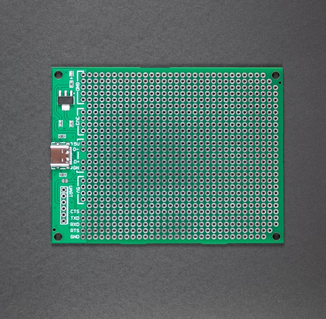

# AN-216 USB-TypeC ユニバーサル基板V2・緑 

# 商品説明

USB-TypeCケーブルを使って、5V電源とUSB2.0用通信を引き出したユニバーサル基板です。

秋月電子通商のBタイプ基板とサイズ互換があります。

CC端子に抵抗を取り付ける事が出来ますので、TypeCタイプの電源アダプタからも5Vを取得できます。

基板にはレギュレータもあり、3.3Vを取得する事が出来ます。

これにより3.3V系のマイコン開発が非常に楽になると思います。

* 此方は実装済み基板です。V2なのはレギュレータを変更しました。

# 仕様

- 基板サイズ
- パッド：両面スルーホール（1mm穴 2mmパッド）
- 基板厚：1.6mm
- ねじ穴:3.2mm　x4
- 追加機能：USB-TypeC　上下対応
- 　　　　　USB2.0規格対応
- 　　　　　CC端子に対応
- 　　　　　USB5Vを3.3V@800mAに変換
- 　　　　　FTDI系のシリアルケーブルを接続するポート付き
- JANコード: 4589775472114		
# 内容物

- 実装済み基板　１枚

# V1とV2の違いについて

部品調達をグローバルに行う為、手に入りやすい安価なレギュレータに変更しました。

# 資料

 - 回路図 & 外形寸法 & 部品表

    

